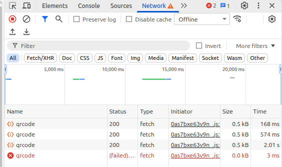

# Benchmark — Vitesse de génération du QR code selon la connexion réseau

## Méthode

Mesure effectuée via l'onglet **Network** de Chrome DevTools, en changeant l'état de connexion, puis en déclenchant la génération du QR code (`GET /transactions/qrcode`) pour chaque profil.

## Résultats

| Profil réseau simulé | Temps de génération |
|---|---|
| Fast 4G | 168 ms |
| Slow 4G | 574 ms |
| 3G (Slow 3G) | 2,01 s |
| Offline | Échec — requête non aboutie |

## Constat

- Sur des connexions correctes (Fast 4G, Slow 4G), la génération reste largement sous la barre des 2 secondes fixée par le cahier des charges.
- En 3G, le temps mesuré (2,01 s) dépasse très légèrement le seuil.
- En mode complètement hors ligne, la requête échoue.
