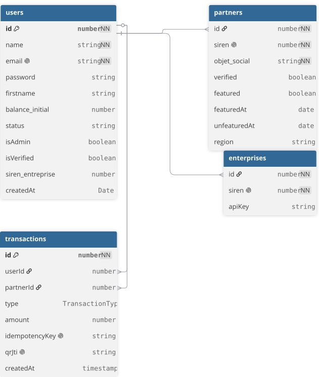

# db Schema

## utilisation et conservation/archivage des données

### informations générale

### informations sur la base de donnée

- **[Table utilisateurs](./db_rgpd_table_user.md)**
- **[Table partenaires](./db_rgpd_table_partner.md)**
- **[Table transactions](./db_rgpd_table_transactions.md)**

